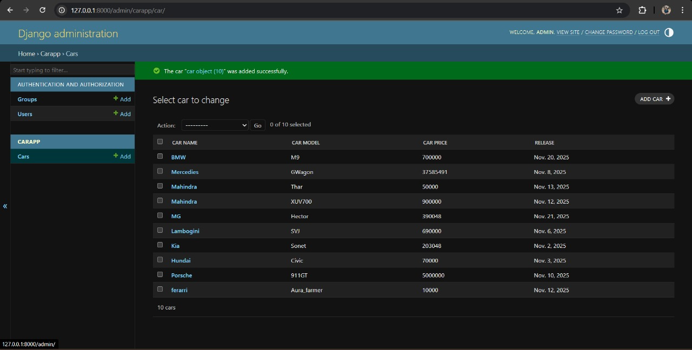

# Ex02 Django ORM Web Application
## Date: 19-11-2025

## AIM
To develop a Django application to store and retrieve data from a Car Inventory Database using Object Relational Mapping(ORM).

## DESIGN STEPS

### STEP 1:
Clone the problem from GitHub

### STEP 2:
Create a new app in Django project

### STEP 3:
Enter the code for admin.py and models.py

### STEP 4:
Execute Django admin and create details for 5 Car 

## PROGRAM
```
models.py
from django.db import models
from django.contrib import admin
class car(models.Model):
    car_name=models.CharField(max_length=100)
    car_model=models.CharField(max_length=100)
    car_price=models.IntegerField()
    release = models.DateField()

class caradmin(admin.ModelAdmin):
    list_display = ('car_name','car_model','car_price','release')
admin.py
from django.contrib import admin
from .models import car,caradmin
admin.site.register(car,caradmin)
```
## OUTPUT



## RESULT
Thus the program for creating car inventory database database using ORM hass been executed successfully
